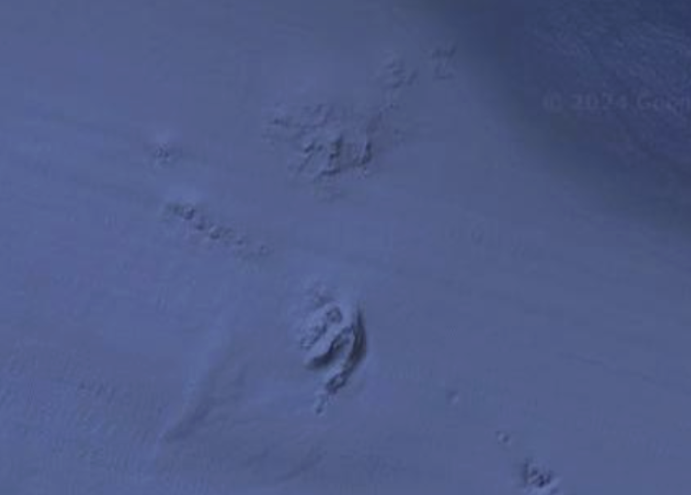

# A Tale of Two Reefs

## Context

This project was completed for the course **ESM 242: Natural Resource Economics**, taught in Fall 2024 at the Bren School, UCSB. The course was instructed by **Dr. Andrew Plantinga**. For the final project, we were asked to explore a natural resource optimization problem of our choice.

This project was inspired by a real experience of my peer **Jackson Hayes**, who is an avid outdoorsman and enjoys spearfishing, among other ocean activities. At County Line in Malibu, he visited a nearshore reef and noticed that fish populations had been drastically reduced. He observed that a local fishing charter company repeatedly visited the same reef. Jackson suggested that the captain alternate reefs to allow the fish populations time to recover, but this idea was rejected. We decided to model this situation and conduct a more quantitative investigation.  

## Results

Under the realistic ranges of parameters we tested, we found that **harvesting a single reef was the optimal solution**, which contradicted our initial hypothesis. Our parameters were based on Jackson's observations and intuition, so this is an important caveat.

## Future Work

Some avenues that could extend and improve this project:

1. **Better modeling of utility costs per trip:**  
   One interesting finding was that introducing a fixed cost per fishing trip produced alternating behaviors in the optimized harvest schedule (see slide 21 in our presentation), which aligns more closely with our original expectations. This suggests that the **utility cost of fishing trips** may play a key role in reef management, and developing a more realistic model of these costs could be a valuable direction for future work.

2. **Recurring monthly schedule optimization:**  
   Currently, we model harvests over 24 monthly periods, which imposes a **limited event horizon**. A potential extension is to optimize a **12-month schedule** that could then be repeated across multiple years. This would reduce the number of variables in the optimization while allowing the results to be applied over an indefinite timeframe, potentially producing more practical and generalizable management recommendations.

---

## Links

- **Interactive Shiny App:** [https://rkanderson.shinyapps.io/tale_of_2_reefs/](https://rkanderson.shinyapps.io/tale_of_2_reefs/)  
- **Slides Presentation:** [Google Slides](https://docs.google.com/presentation/d/1reWezVA3fjr1qzyvOK9XN3tgUJsTUQMyKtnIr2PzJhQ/edit?slide=id.g319e17b3570_0_32#slide=id.g319e17b3570_0_32)

---

## Credits

Thanks to my Bren colleagues who collaborated on this project:

- **Jackson Hayes:** [LinkedIn](https://www.linkedin.com/in/jackson-hayes-234aa6134/)  
- **Emma Tao:** [LinkedIn](https://www.linkedin.com/in/emma-tao-8580861a6/)

---

## Stock Dynamics

The basic stock dynamic equation is:

$$
X_{t+1} = X_t + F(X_t) - H_t + M(X_t)
$$

where:  
- $F(X_t)$ is the fish added to the stock at period $t$ due to reproductive growth,  
- $H_t$ is the fish harvested at period $t$,  
- $M(X_t)$ is the fish added due to migration.  

We model $F(X_t)$ using logistic growth:

$$
F(X_t) = r X_t \left( 1 - \frac{X_t}{K} \right)
$$

and $M(X_t)$ as:

$$
M(X_t) = z (K - X_t)
$$

where $z$ is the migration rate parameter.  
- $z = 0$ → no migration  
- $z = 1$ → the reef reaches full carrying capacity in one time period  

The total harvest in a period is the sum of harvests at the two reefs:

$$
H_t = q (E_{1t} X_{1t} + E_{2t} X_{2t})
$$

where $q$ is the catchability coefficient, and $E_{1t}$, $E_{2t}$ are fishing efforts at reef 1 and reef 2, respectively.  

To model the limited resources of our hypothetical recreational fishing company, we impose a constraint on total effort:

$$
E_{1t} + E_{2t} \leq E_{\text{max}}
$$

---

## Objective Function

Our goal is to maximize:

$$
\text{Obj}(E_1, E_2) = \sum_{t=1}^T \rho^{t-1} \Big( \ln(a H_t + 1) - c (E_{1t} + E_{2t}) \Big)
$$

- The natural log serves as a utility function, where its concavity captures **diminishing returns** from harvesting more fish.  
- The $+1$ term ensures utility is zero when $H_t = 0$.  
- The constant $a$ scales $H_t$ for optimization purposes.  
- $c$ is the cost coefficient for fishing effort.

---

## Parameter Table

<TODO: Add parameter table here>
